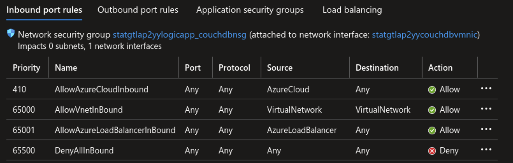

# Azure Cloud

| Scenario ID  | Service Tag  |
| ------------ | ------------ |
| `azurecloud` | `AzureCloud` |

## Setup

Setup of this scenario follows the standard setup steps outlined in the [main README](../README.md#Deployment).

## Scenario

In this scenario we're looking at taking advantage of the `AzureCloud` service tag to access a REST API. I've used CouchDB as an example service, but this should be applicable to any HTTP service.


In the target organisation, CouchDB is deployed to a linux virtual machine with a public IP address. The associated network interface has a Network Security Group (NSG) attached permitting inbound traffic from the `AzureCloud` service tag only.



Based on this configuration, if an attacker tried to interact with the CouchDB REST API directly, they would be blocked due to matching the catch-all deny inbound rule on the NSG.


Instead, the attacker could set up a virutal machine within their own Azure environment and use this to interact with the CouchDB deployment.


For this example, we're just going to be using HTTP basic authentication, this works by setting the `Authorization` header constucted as follows:

```plain
Basic <Base64 encoding of username:password>
```

You can find any of the URIs & credentials for this scenario in the output of `terraform apply` e.g.:

```plain
azurecloud = {
  "cdb_password" = "admin"
  "cdb_username" = "admin"
  "ssh_command" = "ssh -i /home/vagrant/repos/service-tag-abuse/keys/staatkazcue1xattackvm_rsa adminuser@staatkazcue1xattackvm.uksouth.cloudapp.azure.com"
  "target_url" = "http://statgtazcue1xcouchdbvm.uksouth.cloudapp.azure.com:5984/}"
}
```

If you call try to call the API directly, you'll notice that the request fails. Instead, you can SSH into the deployed attacker VM using the `ssh_command` value provided in the terraform output.

In the below example, we're retrieving a list of databases.

```sh
> ssh -i /home/vagrant/repos/service-tag-abuse/keys/staatkazcue1xattackvm_rsa adminuser@staatkazcue1xattackvm.uksouth.cloudapp.azure.com
AUTH_HEADER="Authorization: Basic $(echo -n admin:admin | base64)"

> curl -H $AUTH_HEADER http://statgtazcue1xcouchdbvm.uksouth.cloudapp.azure.com:5984/_all_dbs | jq
```

With the above request, we get the following json in the response body:

```json
[
  "_global_changes",
  "_replicator",
  "_users",
  "product_catalogue"
]
```

Some additional examples of interating with this service can be found in the [logic app scenario documentation](../logicapps.md).
