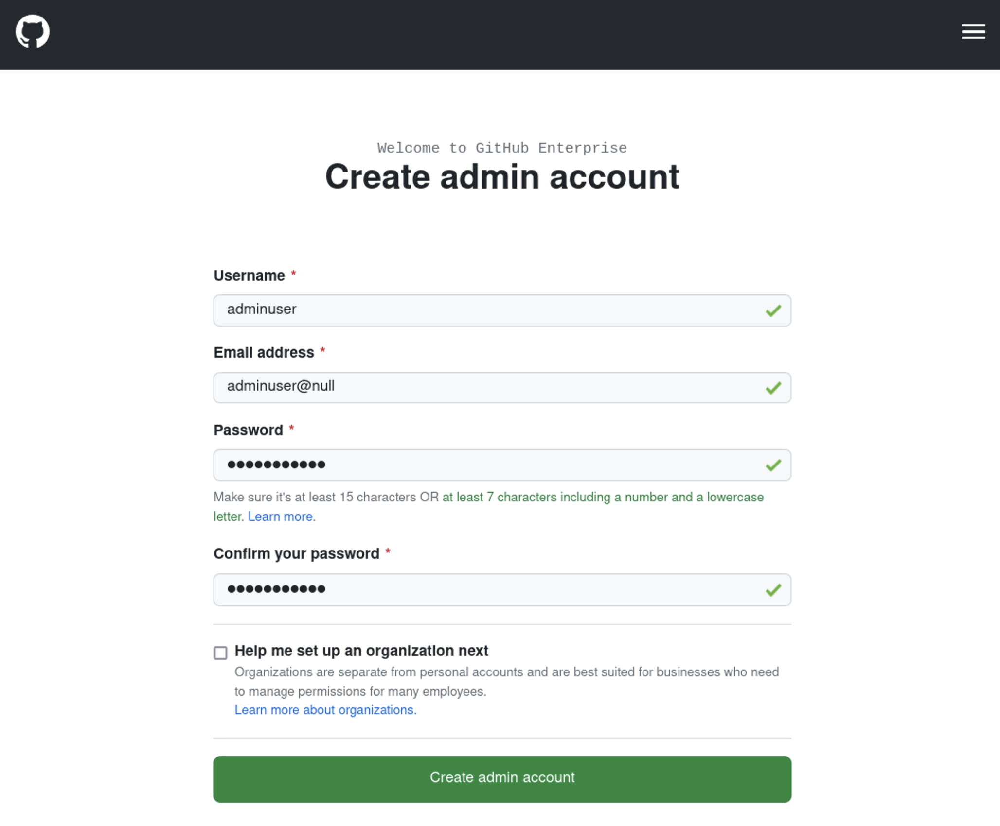
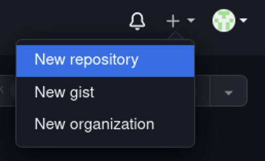
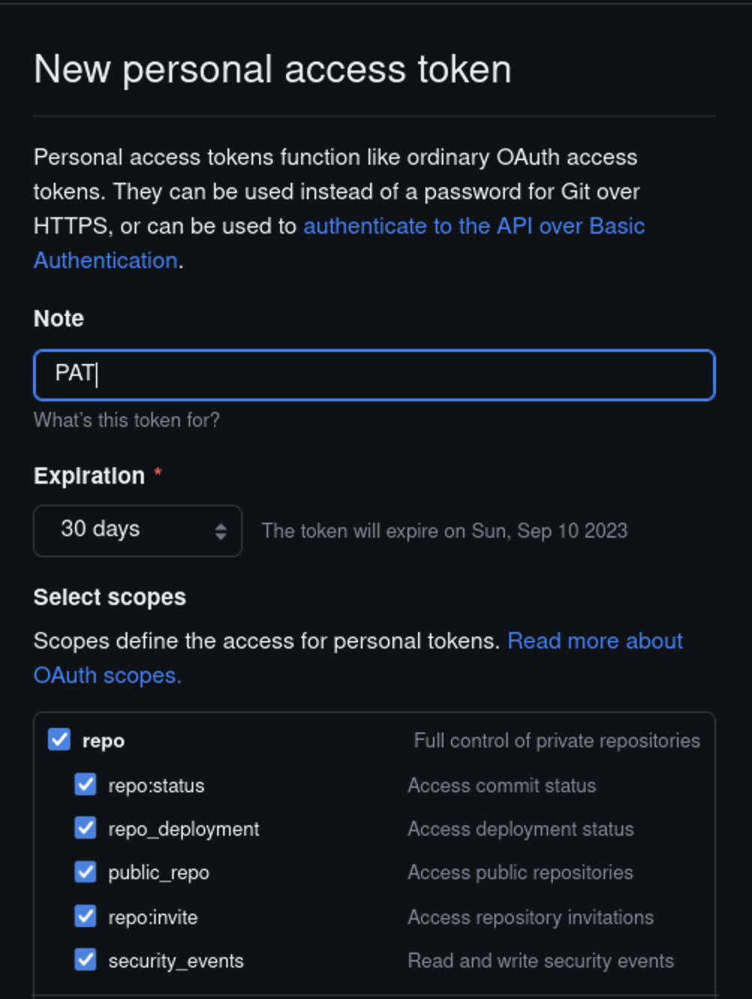

# Azure DevOps

| Scenario ID | Service Tag   |
| ----------- | ------------- |
| `devops`    | `AzureDevOps` |


## Setup

The setup for this scenario is a bit more involved than others. Before we get started, you'll need to have a valid GitHub enterprise license. You can grab a trial [here](https://enterprise.github.com/trial). So get that set up and download the `.ghl` license file. You'll need to place this file at `assets/devops/enterprise.ghl`

Next we'll need to run an initial `terraform apply`, there'll be a few relevant details provided in the output e.g.:

```sh
devops = {
  "attacker_ado_url" = "https://staatkadoe74xado.visualstudio.com/"
  "github_url" = "https://statgtadoe74xgithubvm.uksouth.cloudapp.azure.com/"
  "proxy_cmd" = "ssh -N -D 8080 -i /home/vagrant/repos/service-tag-abuse/keys/statgtbastione74xbastionvm_rsa adminuser@statgtbastione74xbastionvm.uksouth.cloudapp.azure.com"
  "proxy_host" = "127.0.0.1"
  "proxy_port" = "8080"
}
```

We can then run the ansible provisioning for the GitHub host. This can be done by executing the following command from within the `ansible/` directory:

`ansible-playbook -i ./inventory.yml playbook.yml -l 'github'`

This will configure the GitHub instance for you - it will take some time to fully complete.

### Proxy

The next step is to connect to the GitHub enterprise admin console to get it setup. Since we can't connect directly to the target due to the network configuration, we can use the deployed bastion host to run a SOCKS proxy. The command for doing this should be provided in the terraform output property `proxy_cmd` e.g.:

`ssh -N -D 8080 -i ../keys/host_rsa adminuser@shost.region.cloudapp.azure.com`

Executing that command will establish our tunnel, allowing us to access the GitHub service. You'll need to configure the proxy in your browser. You can either use your browser's native proxy controls or use an extension, whichever is easiest. The key configuration details are as follows:

| Proxy Type | Proxy Host (HTTP & HTTP)       | Proxy Port                     | DNS over SOCKS v5 |
| ---------- | ------------------------------ | ------------------------------ | ----------------- |
| SOCKS v5   | terraform output: `proxy_host` | terraform output: `proxy_port` | Enabled           |

> Port `80` on the GitHub VM will be left open to the internet in this setup. That allows for the automation of TLS certificates through Let's Encrypt but will not allow for access to any GitHub services from the internet. Requests to the application on port `80` will be redirected to port `443` which is blocked.

### Account Setup

You should now be able to access the deployed GitHub service by visiting the URL provided in the terraform output value `github_url`. Complete the presented form to create an administrator account.



### Repository Setup

Let's get a repository set up now. You'll need to first setup a repository in the deployed GitHub Enterprise instance. This can be done by selecting the `+` button at the top right hand corner of any page in the web interface. Make sure you take a note of the repository URI as that will be required shortly.



You can use any sample repository, however for demonstration purposes we'll use [a Node.js MS Graph sample project](https://github.com/microsoftgraph/msgraph-sample-nodeexpressapp).

- Clone repository `git clone https://github.com/microsoftgraph/msgraph-sample-nodeexpressapp`
- Change directory to the downloaded repo `cd msgraph-sample-nodeexpressapp`
- Add the github server target `git remote add ghe <URI for created repo>`
- Copy the Azure pipeline file from `assets/devops/azure-pipeline.yml` to the root of the repository
- Add a commit for the pipeline addition `git add .; git commit -m 'adding az pipeline'`
- Push the repository to the GitHub enterprise instance `HTTPS_PROXY=socks5://<proxy_host>:<proxy_port>  git push -u ghe main`

### Personal Access Token Setup

You'll need a Personal Access Token (PAT) to configure the integration with Azure DevOps. Head to the following URL to generate a PAT with the required scopes:

`https://<githubURI>/settings/tokens/new?scopes=repo,user,admin:repo_hook`



Take note of the configured token as it'll be required for the next step. This token will also represent the leaked credentials.

You no longer need the Socks proxy running, so you can terminate the corresponding ssh command.

### DevOps Setup

We can now configure the target Azure DevOps deployment. This will consist of two stages, similar to the core scenario deployment:

- Resource deployment using Terraform
- Resource configuration using Ansible

For the Terraform deployment:

- Navigate to `generated/devops/terraform`
- Run `terraform init -upgrade`
- Run `terraform apply`

You should be prompted for the value of the GitHub PAT that you created previously, enter this to deploy the requisite configurations in Azure DevOps.

Finally, for the pipeline runner configuration with Ansible:

- Navigate to `ansible/`
- Run `ansible-playbook -i ./inventory.yml ./playbook.yml -l 'adorunner'`

This should configure the Azure DevOps runner for the target environment. This runner will be added to the agent pool for the defined pipeline.

## Scenario

Details of exploiting this scenario pending...
